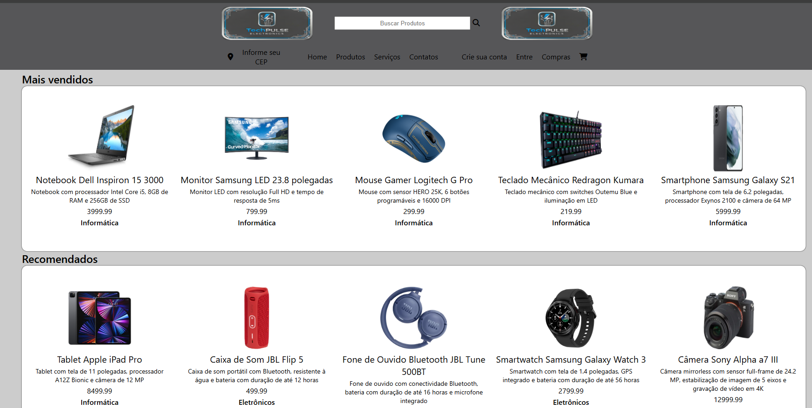

# 🛍️ Vitrine de Produtos de Tecnologia

Este projeto é uma vitrine de produtos de tecnologia, desenvolvido como um desafio para aprimorar os conhecimentos em desenvolvimento Front-End. A página exibe uma lista de produtos de forma dinâmica, carregando os dados a partir de um arquivo JSON.

## ✨ Funcionalidades

  - **Carregamento Dinâmico de Produtos:** Os produtos são carregados a partir de um arquivo JSON e exibidos na página de forma organizada.
  - **Modal de Detalhes:** Ao clicar em um produto, um modal é exibido com informações detalhadas, como nome, descrição, preço e classificação.
  - **Layout Responsivo e Estilizado:** A interface foi criada com foco na experiência do usuário, utilizando CSS para estilizar os componentes e garantir uma boa apresentação.
  - **Classificação por Estrelas:** Cada produto possui uma classificação por estrelas, que é exibida de forma visual para o usuário.

## 🚀 Tecnologias Utilizadas

  - **HTML5**
  - **CSS3**
  - **JavaScript**
  - **Git e Github** para versionamento.

## ⚙️ Como Executar

Para visualizar o projeto, basta seguir os passos abaixo:

1.  **Clone o repositório** para a sua máquina local.
2.  Abra o arquivo `index.html` em seu navegador de preferência.

Não é necessária nenhuma instalação adicional para rodar o projeto.

## 👨‍💻 Autor

Este projeto foi desenvolvido por **Gabryel Fillipe**. Conecte-se comigo no LinkedIn\!

(https://www.linkedin.com/in/gabryel-fillipe/)

